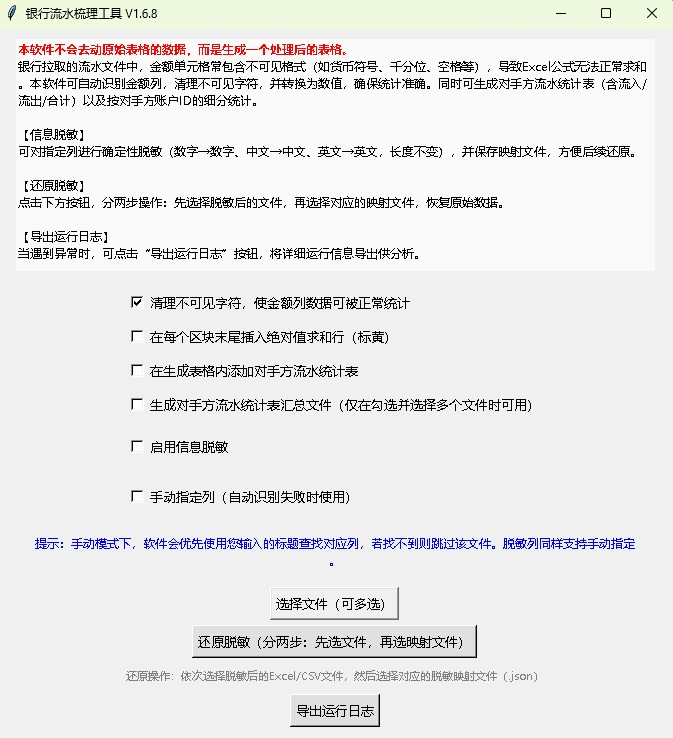
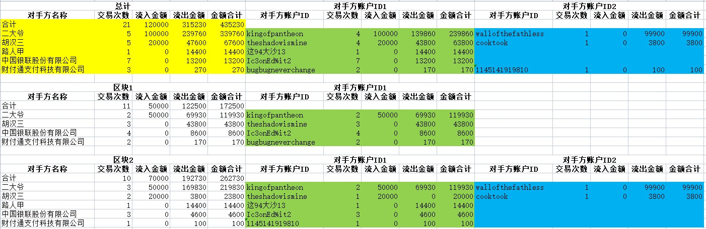

# 银行流水梳理工具 V1.6.8

一款免费、离线的银行流水表格处理工具，可自动识别多区块流水文件，清理金额列不可见字符（货币符号、千分位等），并生成按对手方分类的统计表（含流入/流出/合计及对手方账户ID细分）。

## ✨ 主要功能

- 支持 Excel（.xlsx / .xls）和 CSV 格式流水文件
- 自动识别表头行、金额列、对手方名称列、对手方ID列、交易方向列
- 智能切分文件中的多个用户/区块（重复表头）
- 可选：清理金额列不可见字符，转为纯数值，确保公式可正常统计
- 可选：在每个区块末尾插入绝对值求和行（黄色高亮）
- 生成内部统计表（对手方统计汇总）：
  - 总计区域 + 各区块独立区域
  - 按对手方汇总流入/流出/合计，并横向列出每个对手方账户ID的细分统计
  - 总计区域A~E列黄色背景，ID块绿蓝交替颜色
- 支持跨文件汇总：处理多个文件时自动生成一份“对手方汇总统计.xlsx”汇总表
- 信息脱敏：可对指定列进行确定性脱敏（数字→数字、中文→中文、英文→英文，长度不变），并保存映射文件，方便还原
- 提供日志导出功能，便于排查异常

## 🖼️ 界面截图

## 📥 下载与使用

### 方式一：直接使用打包好的 exe（无需 Python 环境）

1. 进入 [Releases](../../releases) 页面，下载最新版 银行流水梳理工具.exe
2. 双击运行，GUI 界面操作，按提示选择流水文件即可

### 方式二：修改源代码（需 Python 3.8+）

1. 克隆本仓库
2. 以记事本打开修改.py格式的源代码
3. 在根目录放置唯一的.ico格式的你想要的图片
4. 双击 打包成EXE就双击我.bat 自动安装运行环境及依赖库后即可打包
5. 双击运行，GUI 界面操作，按提示选择流水文件即可

## 📖 使用说明
1. 启动软件后，勾选所需功能（默认开启“清理不可见字符”）
2. 点击“选择文件（可多选）”，选取银行流水文件
3. 等待处理完成，生成的文件将在原始文件同目录下，文件名后缀为 _已处理.xlsx
4. 若勾选“生成对手方流水统计表”，处理后的 Excel 内会新增一个名为“对手方统计汇总”的工作表
5. 若同时处理多个文件并勾选“生成对手方流水统计表汇总文件”，则会在第一个文件目录下生成 对手方汇总统计.xlsx
6. 脱敏功能会保存映射文件（.json），可通过“还原脱敏”按钮恢复原始数据

## 🛠 技术要点
- 自动识别表头行基于关键词匹配（支持银行常用列名）
- 金额列识别通过数值占比判断
- 对手方ID列及方向列使用表头关键词匹配
- 区块切分基于重复表头行特征
- 脱敏算法采用确定性伪随机，保留类型和长度

## 📦 项目结构
- 源代码.py # 主程序（文件名可能不同）
- build.bat # 一键打包脚本（自动安装 Python 及依赖）
- 软件图标.ico # 应用图标（可自定义）
- README.md # 本说明文档

## 📄 许可证
本项目采用 MIT License（若添加了 LICENSE 文件）。欢迎自由使用、修改和分发。

## 🙏 致谢
如果本工具对你有帮助，欢迎给个 Star ⭐ 或分享给需要的人。
